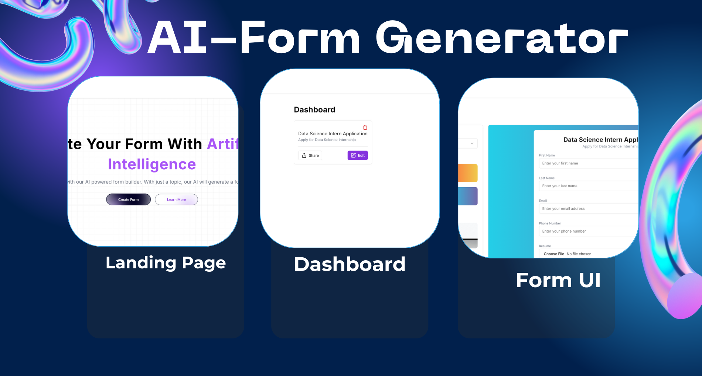

   
  
   

  

    
    
    
    
    
    
    
    
    
    
    
    
  

  <h3 align="center">AI Form Builder - AI-Driven Form Generation SaaS</h3>

  

    Experience the future of form creation with AI Form Builder, a SaaS platform that allows users to generate, edit, and share forms effortlessly using AI. With seamless integrations, advanced features, and a user-friendly interface, AI Form Builder is the ultimate tool for creating forms that can be shared via links, with responses exportable in XLSX format.
  

   

  

    <a href="https://ai-form-generation.vercel.app/" target="_blank">
      <button style="background-color: #3178C6; color: white; padding: 10px 20px; border: none; border-radius: 5px; font-size: 16px; cursor: pointer;">Open Application</button>
    </a>
  

## 📋 <a name="table">Table of Contents</a>

1. 🤖 [Introduction](#introduction)
2. ⚙️ [Tech Stack](#tech-stack)
3. 🔋 [Features](#features)

## 🚨 About

AI Form Builder is a comprehensive SaaS web application that leverages the power of AI to streamline the process of form creation. Whether you need to create simple surveys or complex data collection forms, AI Form Builder makes it easy to generate, edit, and share forms.

## <a name="introduction">🤖 Introduction</a>

With AI Form Builder, you can effortlessly create forms using AI-driven prompts. The platform integrates advanced AI models to help generate form fields and layouts. It offers a robust dashboard for managing existing forms, sharing them via links, and collecting user responses, which can be exported in XLSX format. The application also includes a phenomenal landing page, supports various user authentication and payment gateway options, and is designed to cater to both free and pro users.

## <a name="tech-stack">⚙️ Tech Stack</a>

- **Google Gemini API**: AI functionalities.
- **Clerk**: User authentication.
- **Neon**: Database management.
- **Drizzle ORM**: Database interactions.
- **TypeScript with Next.js**: Core application framework.
- **Shadcn**: Component library.
- **DaisyUI**: Component library.
- **Eternity UI**: Component library.
- **Stripe**: Payment gateway.

## <a name="features">🔋 Features</a>

👉 **AI-Driven Form Generation**: Create forms with AI assistance, saving time and effort.

👉 **Editable Forms**: Easily edit existing forms and share them with others.

👉 **Response Management**: Collect and manage responses, with the option to export data in XLSX format.

👉 **Seamless Integrations**: Incorporates authentication, payment gateways, and a user-friendly dashboard.

👉 **Phenomenal Landing Page**: A modern and engaging landing page to attract users.

👉 **Pro and Free Plans**: Offers different plans to suit various user needs.
